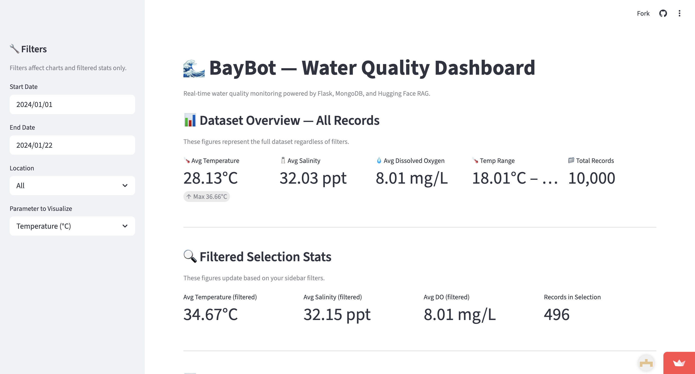
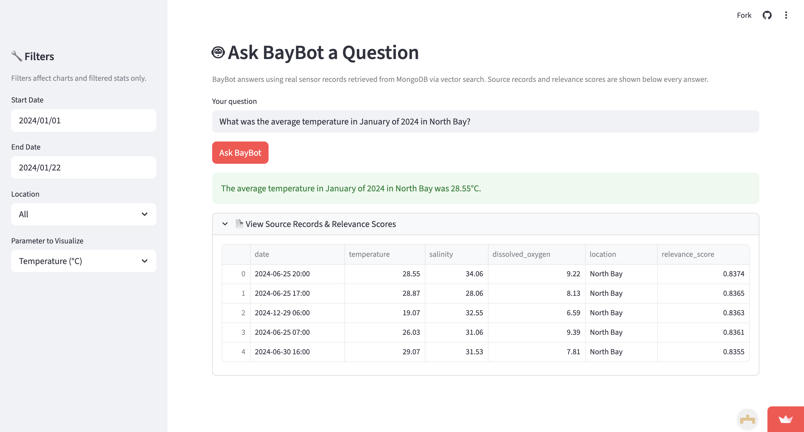
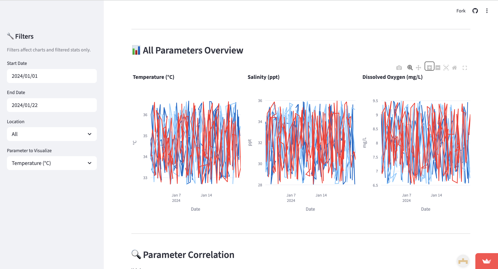

# 🌊 BayBot — Water Quality RAG Dashboard

BayBot is a full-stack AI-powered water quality monitoring dashboard that combines 
a Flask REST API, MongoDB database, Streamlit frontend, and a Retrieval-Augmented 
Generation (RAG) chatbot. It was built to demonstrate how real environmental sensor 
data can be made accessible and queryable through both visual dashboards and 
natural-language conversation.

---

## 🔗 Live Demo
👉 [BayBot Dashboard](https://rag-baybot.streamlit.app) — Frontend
👉 [BayBot API](https://rag-baybot.onrender.com/api/stats) — REST API (click to verify)

---

## 📸 Screenshots

| Dashboard | Chatbot |
|---|---|
|  |  |

| All Parameters | Correlation |
|---|---|
|  |  |
---

## 📋 Table of Contents
- [Why BayBot Exists](#why-baybot-exists)
- [How the System is Architected](#how-the-system-is-architected)
- [Tech Stack and Why Each Tool Was Chosen](#tech-stack-and-why-each-tool-was-chosen)
- [How the RAG Pipeline Works](#how-the-rag-pipeline-works)
- [API Endpoints](#api-endpoints)
- [Project Structure](#project-structure)
- [How to Run Locally](#how-to-run-locally)
- [Deployment](#deployment)
- [Future Improvements](#future-improvements)

---

## Why BayBot Exists

Raw sensor data sitting in a database is only useful if people can access and 
understand it. BayBot solves two problems:

**Problem 1 — Visualization:** Water quality researchers and environmental 
scientists need to spot trends across thousands of readings without manually 
querying a database. BayBot surfaces this through interactive charts with 
dynamic filters for location, date range, and parameter.

**Problem 2 — Natural Language Access:** Not everyone who needs water quality 
insights knows SQL or Python. BayBot's RAG chatbot lets anyone ask plain-English 
questions and receive answers grounded in the actual sensor data, with citations 
to the exact records used — no technical knowledge required.

---

## How the System is Architected

BayBot is built in four distinct layers, each with a single responsibility. 
This separation ensures that changes to one layer don't break the others, 
and that each component can be tested and deployed independently.

┌─────────────────────────────────────┐
│         Streamlit Frontend          │  ← What the user sees and interacts with
│   Charts · Filters · Chat UI        │
└────────────────┬────────────────────┘
│ HTTP requests
┌────────────────▼────────────────────┐
│           Flask REST API            │  ← Middleman between frontend and data
│   Endpoints · Validation · Routing  │
└──────────┬──────────────────────────┘
│                    │
┌──────────▼──────────┐  ┌─────▼──────────────────┐
│     MongoDB Atlas   │  │     RAG Pipeline        │
│  Sensor Data Store  │  │  Retrieve · Augment ·   │
│  Vector Index       │  │  Generate               │
└─────────────────────┘  └─────────────────────────┘

**Why this architecture matters:**
The frontend never talks directly to the database. Every request goes through 
Flask, which acts as a secure gatekeeper — validating inputs, enforcing limits, 
and controlling exactly what data gets exposed. This is standard practice in 
production software and prevents the database from being directly exposed to 
the internet.

---

## 🛠 Tech Stack and Why Each Tool Was Chosen

**Flask** was chosen as the API framework because it is lightweight and 
unopinionated, meaning it gives full control over how endpoints are structured 
without imposing a rigid framework. For a data API with a small number of 
focused endpoints, Flask is more appropriate than heavier frameworks like Django.

**MongoDB Atlas** was chosen over a relational database because sensor data is 
document-oriented — each reading is a self-contained record with no complex 
relationships to other tables. MongoDB also provides native Vector Search, which 
is essential for the RAG pipeline to perform similarity lookups directly inside 
the database rather than pulling all records into memory.

**Streamlit** was chosen for the frontend because it allows a full interactive 
dashboard to be built entirely in Python, eliminating the need for a separate 
HTML/CSS/JavaScript layer. Every widget, chart, and filter is declared in a 
single Python file, which makes it ideal for data-focused applications.

**Plotly** was chosen for visualizations because it produces interactive charts 
natively — users can zoom, pan, hover for exact values, and toggle series on and 
off without any additional configuration. This interactivity is built into every 
chart by default.

**Sentence Transformers (all-MiniLM-L6-v2)** was chosen as the embedding model 
because it is small enough to run without a GPU, fast enough for real-time 
queries, and accurate enough for semantic similarity on short environmental 
descriptions. It converts both user questions and sensor records into 384-dimensional 
vectors that can be compared mathematically.

**Hugging Face (facebook/bart-large-cnn)** was chosen as the generation model 
because it is a reliable summarization model that stays warm on Hugging Face's 
free inference tier. It reads the retrieved sensor data context and produces 
a concise natural-language answer grounded in the actual records.

---

## How the RAG Pipeline Works

RAG — Retrieval-Augmented Generation — solves a fundamental limitation of AI 
language models: they only know what they were trained on. BayBot's sensor data 
did not exist when the models were trained, so without RAG, the model would have 
no basis for answering questions about it.

RAG bridges this gap in three stages:

**Stage 1 — Retrieval**
When a user submits a question, it is converted into a 384-dimensional vector 
using the Sentence Transformer embedding model via the Hugging Face Inference API. 
This vector numerically represents the semantic meaning of the question. 
MongoDB Atlas Vector Search then compares this vector against pre-computed vectors 
stored alongside every sensor record, using cosine similarity to measure how 
closely each record's meaning aligns with the question. The top 5 most relevant 
records are returned.

**Stage 2 — Augmentation**
The 5 retrieved records are formatted into a structured context block and 
injected directly into the prompt sent to the language model. The model is 
explicitly told to base its answer only on this data, preventing hallucination.

**Stage 3 — Generation**
The facebook/bart-large-cnn model reads the augmented prompt and generates a 
natural-language answer. Because the answer is derived from actual retrieved 
records, it is grounded in fact. The source records are also returned alongside 
the answer so the user can verify exactly which data points were used.

User submits question
↓
Sentence Transformer converts question to vector via HF API
↓
MongoDB Vector Search finds top 5 most relevant sensor records
↓
Records are injected into the model prompt as context
↓
facebook/bart-large-cnn generates a grounded natural-language answer
↓
Answer + source citations returned to the Streamlit frontend

---

## 📡 API Endpoints

All endpoints are served at `https://rag-baybot.onrender.com`

### `GET /api/sensors`
Retrieves water quality sensor records from MongoDB. Supports query parameters 
for limiting the number of records returned and filtering by geographic location. 
Records are returned in chronological order. This endpoint powers the Streamlit 
charts and data table.
👉 Try it: https://rag-baybot.onrender.com/api/sensors?limit=5

### `GET /api/stats`
Returns aggregate summary statistics computed across all sensor records — 
including average temperature, salinity, and dissolved oxygen, and total 
record count. This endpoint powers the metric cards at the top of the dashboard.
👉 Try it: https://rag-baybot.onrender.com/api/stats

### `POST /api/ask`
Accepts a natural-language question in the request body and runs the full 
RAG pipeline. Returns the generated answer and the source sensor records 
that were retrieved and used as context. This endpoint is the entry point 
for the chatbot feature.
Use Postman or curl to test:
curl -X POST https://rag-baybot.onrender.com/api/ask \
  -H "Content-Type: application/json" \
  -d '{"question": "What was the average temperature in March?"}'

---

## 📁 Project Structure

```
baybot/
│
├── app.py               # Flask REST API — defines all routes and handles
│                        # request validation and response formatting
│
├── database.py          # MongoDB connection management and schema validation —
│                        # centralizes all database access so no other file
│                        # connects to MongoDB directly
│
├── rag.py               # RAG pipeline — handles embedding generation,
│                        # MongoDB vector search retrieval, prompt construction,
│                        # and Hugging Face answer generation
│
├── streamlit_app.py     # Streamlit frontend — all charts, filters, sidebar
│                        # widgets, metric cards, and chatbot UI live here
│
├── seed_data.py         # One-time data seeding script — generates 10,000
│                        # realistic sensor readings and stores them in MongoDB
│                        # with pre-computed vector embeddings
│
├── requirements.txt     # All Python dependencies with pinned versions
├── .env.example         # Template showing required environment variables
│                        # without exposing actual credentials
└── .gitignore           # Prevents .env, caches, and venv from being committed
```
---

## 🚀 How to Run Locally

### Prerequisites
- Python 3.11 or higher
- A free MongoDB Atlas account
- A free Hugging Face account with API token
- PyCharm (recommended) or VS Code

### Setup Steps

**1. Clone the repository**
```bash
git clone https://github.com/AngelaNano/RAG-BayBot.git
cd RAG-BayBot
```

**2. Create and activate a virtual environment**
```bash
python -m venv venv
source venv/bin/activate        # Mac/Linux
venv\Scripts\activate           # Windows
```

**3. Install dependencies**
```bash
pip install -r requirements.txt
```

**4. Configure environment variables**
Copy `.env.example` to `.env` and fill in your credentials:
```bash
cp .env.example .env
```

**5. Seed the database**
Run once to generate 10,000 sensor records with vector embeddings:
```bash
python seed_data.py
```

**6. Start the Streamlit app**
```bash
streamlit run streamlit_app.py
```

The dashboard will open at `http://localhost:8501`

---

## ☁️ Deployment

**Frontend — Streamlit Cloud**
Deployed at [rag-baybot.streamlit.app](https://rag-baybot.streamlit.app). 
Connects directly to MongoDB Atlas and calls the Hugging Face Inference API 
for RAG pipeline execution. Secrets managed through Streamlit Cloud's secrets manager.

**Backend — Render**
Flask REST API deployed at [rag-baybot.onrender.com](https://rag-baybot.onrender.com).
Available for local development use. Environment variables managed through 
Render's dashboard.

**Database — MongoDB Atlas**
Free M0 cluster hosting 10,000 sensor records with pre-computed vector embeddings 
and a Vector Search index for semantic similarity queries.

---

## 🔧 Debugging & Development Notes

During development the following debugging approaches were used:

**MongoDB Connection Testing:**
A standalone connection test script was used to verify MongoDB Atlas 
connectivity before integrating with the main application:
```python
from pymongo import MongoClient
import certifi
client = MongoClient(uri, tlsCAFile=certifi.where())
client.admin.command("ping")
```
This isolated the SSL certificate issue on macOS from the application 
logic, confirming the fix before integrating it into database.py.

---

## 🔮 Future Improvements

- Upgrade the generation model to Claude or GPT-4 for higher answer accuracy 
  and more nuanced responses
- Add anomaly detection to automatically flag sensor readings that fall outside 
  healthy ranges and surface alerts on the dashboard
- Expand the dataset to include additional environmental parameters such as pH, 
  turbidity, and chlorophyll concentration
- Implement user authentication so researchers can save custom filter 
  configurations and query history
- Add CSV export so users can download filtered datasets directly from the dashboard
- Replace synchronous retry logic with exponential backoff and async route 
  handlers for better scalability

---

## 👤 Author
Your Name
[GitHub](https://github.com/AngelaNano) · [LinkedIn](https://linkedin.com/in/yourprofile)

---

## 📄 License
MIT License
